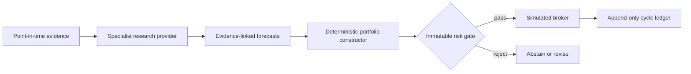

# AegisQuant

> Evidence-first agentic investment research, honest backtesting, deterministic risk, and governed self-improvement.

AegisQuant is a capability-rich modular monolith for **investment research, backtesting, and simulated paper execution only**. Agents may investigate, interpret, challenge, and propose. Typed deterministic components validate evidence, calculate forecasts, construct portfolios, enforce risk, simulate fills, reconcile the ledger, and govern promotion.

## Safety boundary

- No live-broker implementation or entry point.
- Models cannot size positions, modify risk, or place orders.
- Replay and historical modes reject network-capable providers.
- Historical evidence must satisfy `available_at <= as_of`.
- Data-integrity failures halt; model failures abstain.
- Candidate improvements cannot self-promote.

This is research software, not investment advice.

## Quick start

Requires Python 3.12 and [`uv`](https://docs.astral.sh/uv/).

```bash
uv sync --extra lab --extra dashboard
uv run pytest
uv run ruff check aegis apps tests
uv run mypy aegis apps
```

### Standalone institutional company research (v3A)

```bash
uv run aegisquant research company CMPD \
  --as-of 2025-06-30 \
  --fixture data/fixtures/fundamentals/cmpd.json \
  --format markdown
```

This mode does not load a fund, portfolio policy, broker, or cycle ledger. It produces a point-in-time, calculation-backed dossier and standard `AlphaForecast` from a frozen no-network fixture. The independently verified v3A release supports profitable general operating companies; unsupported archetypes explicitly abstain. A v3B implementation candidate is under remediation after independent audit findings; it is not accepted or released. v3C-v3D and the final whole-program release remain planned.

### Institutional multi-strategy research and simulated fund cycle (v3B candidate)

```bash
uv run aegisquant demo screen
uv run aegisquant demo factors
uv run aegisquant demo events
uv run aegisquant demo regimes
uv run aegisquant strategy evaluate
uv run aegisquant fund run
```

The `demo` commands are frozen no-network illustrations, not production research outputs. The fund and comparison commands remain deterministic implementation surfaces but are not release-accepted. The strategy comparison always retains the six predeclared common-sample rows and can only make the combined candidate *eligible for later human review*; it cannot promote it. `fund run` loads the hash-bound four-pod mandate, retains abstained pod budgets as cash, preserves every opposing contribution, creates one `MasterPortfolio`, and crosses only the existing `PortfolioProposal → risk → orders → SimBroker → ledger` seam. The institutional receipt uses the explicit `aegis-cycle-v2` schema while legacy `aegis-cycle-v1` receipts retain their original canonical payload and digest behavior.

`uv run aegisquant fund backtest --help` exposes the historical same-cycle backtest command. The frozen six-strategy v3B evaluation is an implementation fixture, not release authority, until the remaining independent-audit remediation and clean-tree re-audit pass.

### No-key deterministic replay

```bash
uv run aegis replay data/fixtures/cases/nvda_earnings_case.json
```

The command reads only checked-in local Parquet/JSON fixtures, produces a canonical cycle receipt, and appends an idempotent record to `run_data/aegisquant.sqlite`.

### Historical backtest through the same cycle

```bash
uv run aegis backtest \
  --fund configs/funds/demo-fund.yaml \
  --tickers AAPL,MSFT,NVDA,AMZN,GOOGL \
  --start 2024-01-01 \
  --end 2024-12-31
```

Replay and backtest share `aegis.fund.run_cycle.run_cycle`, deterministic portfolio construction, the hard risk gate, and `SimBroker`.

## Implemented deterministic spine

- strict Pydantic v2/v3 case, evidence, filing, statement, valuation, forecast, source, memory, claim, portfolio, risk, execution, and learning contracts;
- standalone v3A company research with exact raw/statement amounts, reversible normalization, institutional metrics, operating scenarios, DCF/reverse DCF/comparables, management history, living theses, closed calculation lineage, and deterministic dossier rendering;
- point-in-time, network-denied Parquet fixture client;
- batch fixture and deterministic historical forecast providers;
- confidence/probability/volatility portfolio construction;
- PIT universe screening, factor diagnostics, event CARs, six-axis regimes, deterministic feature sets, eight dependency-free portfolio models, and optional `skfolio` adapter seam;
- isolated fundamental/event/systematic/defensive pods, numeric-only forecast blending, abstention-as-cash, contribution-preserving netting, and one attributed master portfolio;
- exactly six predeclared common-sample strategy comparisons with append-only losing/rejected trials, cost stress, PBO/PSR/DSR, and eligibility-only outcomes;
- position, gross, net, turnover, cash, sector, strategy, stale-price, shorting, and leverage controls;
- deterministic commission/slippage simulation with atomic batch validation;
- canonical cycle receipts and tamper-evident idempotent SQLite ledger;
- full reproducibility manifest with code/tree/lock/data/evidence/model/skill/cost hashes;
- weekly/monthly backtesting through the production cycle path;
- a replayable LangGraph desk with Coordinator, Quant, Fundamentals, Event/Behavioral,
  Evidence Auditor, independent Bull/Bear/Base-Rate reviewers, CIO, and Verifier;
- strict versioned Markdown skills, bounded context packs, capability authorization,
  budgets, stable parallel reducers, model-failure abstention, and dossier hashing;
- deterministic claim graphs and non-model evidence audit gates;
- mode-gated, official-first source registry/planner, immutable raw store, safe HTML/JSON/XML/text normalization, injection scanning, health/watchers, narrow Agent Reach/Scrapling boundaries, and a live-research CLI;
- append-only governed SQLite memory, EvidenceLedger-bound approval, PIT/expiry/status filtering, contradiction visibility, exact memory snapshot hashes, and a failure-safe optional GBrain adapter;
- locked candidate surfaces, immutable experiment history, built-in and pinned qtype preflight, purged walk-forward/CPCV/PBO/PSR/DSR validation, shadow contracts, independent evaluation, and hash-bound human promotion decisions;
- a strictly read-only Streamlit dashboard over validated cycle receipts;
- no-key CLI and offline/adversarial acceptance tests.

## Governed source research and dashboard

Plan an approved live-research request without fetching:

```bash
uv run aegis sources plan configs/demo/live-source-request.json
```

Acquisition requires an explicit allowlisted HTTPS URL and the `sources` extra; historical and replay requests are rejected before connector invocation. Every fetched byte is committed to the raw store before normalization.

```bash
AEGIS_LEDGER_PATH=run_data/aegisquant.sqlite \
  uv run streamlit run apps/dashboard.py --server.address 127.0.0.1
```

The dashboard is read-only and cannot run cases, approve changes, or submit orders.

## Architecture rule



The agent graph is a forecast provider. It never crosses the portfolio/risk/execution boundary.

## Specifications

- Authoritative build specification: [`docs/BUILD_SPEC.md`](docs/BUILD_SPEC.md)
- v2 compatibility pointer: [`docs/AegisQuant_MVP_Capability_Upgrade_v2.md`](docs/AegisQuant_MVP_Capability_Upgrade_v2.md)
- Historical v1: [`docs/AegisQuant_MVP_Build_Spec.md`](docs/AegisQuant_MVP_Build_Spec.md)
- Authoritative v3 specification: [`docs/specs/AegisQuant_v3_Institutional_Investment_OS_Spec.md`](docs/specs/AegisQuant_v3_Institutional_Investment_OS_Spec.md)
- Authoritative v3 master prompt: [`docs/specs/AegisQuant_v3_Institutional_Codex_Master_Prompt.md`](docs/specs/AegisQuant_v3_Institutional_Codex_Master_Prompt.md)
- v3 acceptance traceability: [`docs/V3_TRACEABILITY.md`](docs/V3_TRACEABILITY.md)

## Provenance and license

AegisQuant began from `virattt/ai-hedge-fund` commit `eff8a7320fcf0b473b135690fa1a5b0d9b022a83`. See [`NOTICE.md`](NOTICE.md) and [`LICENSE`](LICENSE).
