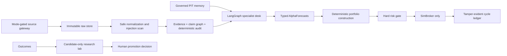

# Architecture

One modular Python application owns one financial path: `aegis.fund.run_cycle.run_cycle`. The graph ends at forecasts. Source workers, memory, research-lab candidates, and the dashboard have no broker capability. Replay and historical providers are sealed local implementations. Live research may acquire approved public evidence, but execution remains simulated paper.
